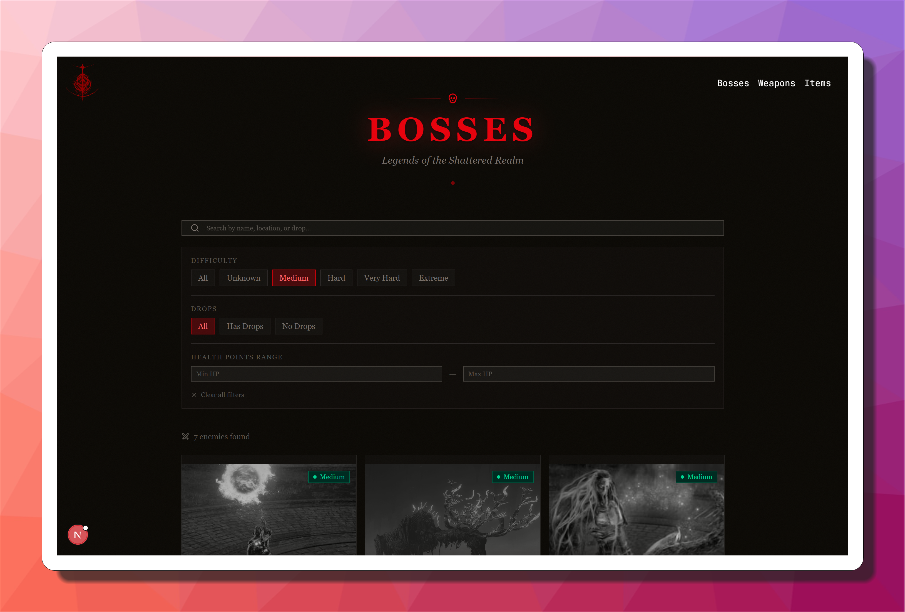
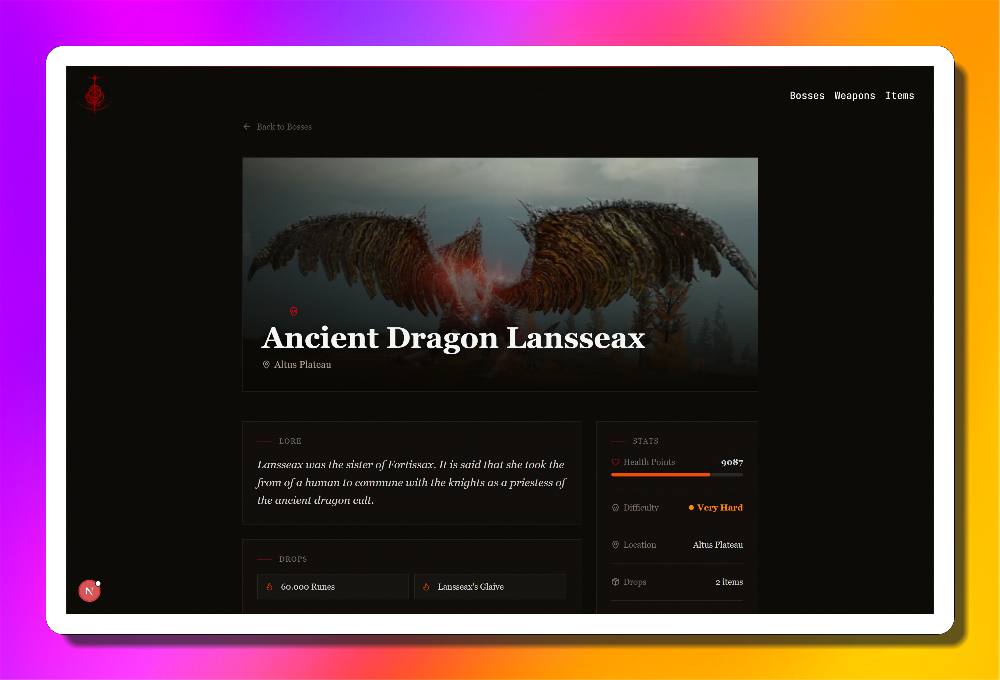
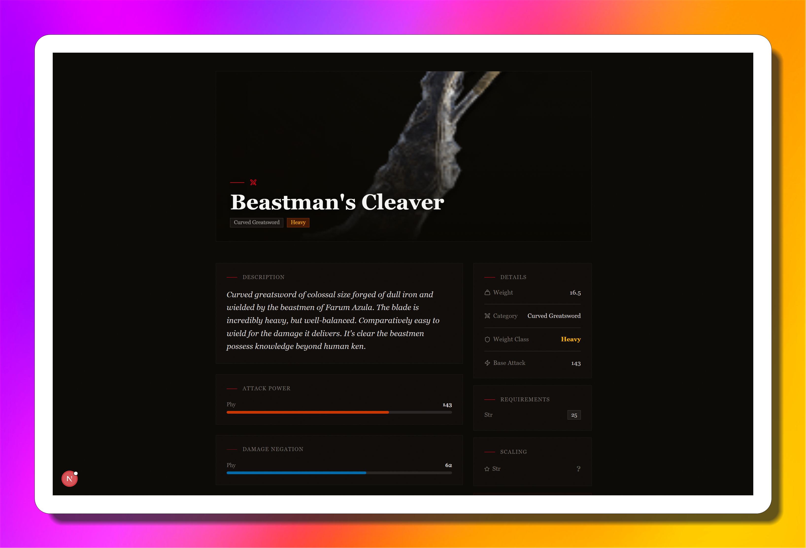
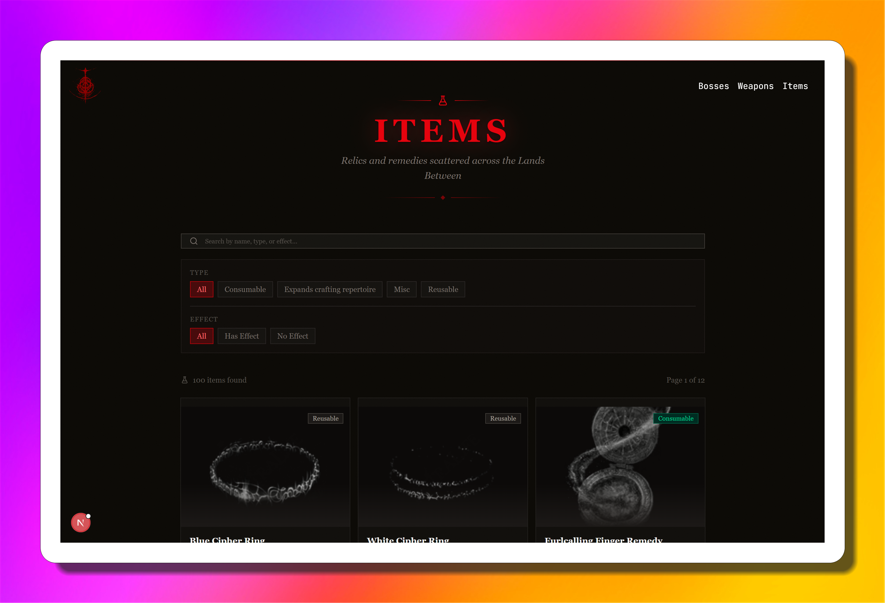
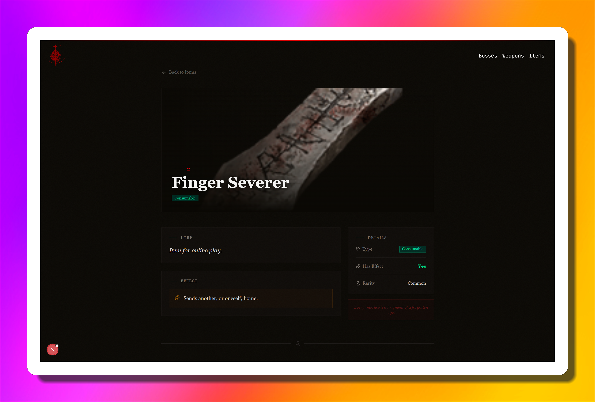

# Mekla - Elden Ring Explorer

Mekla is a modern web application built with Next.js, designed to help Elden Ring players explore bosses, weapons, and items with ease. Featuring a beautiful UI, responsive design, and interactive components, Mekla is your go-to resource for discovering everything the Lands Between has to offer.

## 🚀 Live Demo

[Visit the deployed site: Elden Ring Explorer](https://elden-ring-next-js.vercel.app/)

---

## 📸 Screenshots

Here is a glimpse of the application:


_The landing page of the application, welcoming users to the Elden Ring explorer._


_Overview of the different categories you can explore: Bosses, Weapons, and Items._


_A comprehensive list of all the formidable bosses in Elden Ring._


_Detailed information, stats, and lore about a specific boss._


_Browse through the extensive arsenal of weapons available in the game._


_In-depth stats, scaling, and requirements for a selected weapon._


_Explore various consumables, key items, and crafting materials._


_Detailed description and effects of a specific item._

---

## 📦 Available Scripts

In the project directory, you can run the following commands to use the available scripts:

- **`npm run dev`**: Starts the development server. Open [http://localhost:3000](http://localhost:3000) to view it in your browser.
- **`npm run build`**: Builds the app for production to the `.next` folder. It correctly bundles React in production mode and optimizes the build for the best performance.
- **`npm run start`**: Starts the production server using the built app.
- **`npm run lint`**: Runs ESLint to catch and fix problems in the code.
- **`npm run prepare`**: Sets up Husky Git hooks for the repository.
- **`npm run test`**: Launches the test runner (Vitest) in the interactive watch mode.
- **`npm run format:check`**: Checks the code formatting using Prettier.
- **`npm run storybook`**: Starts the Storybook development server on port 6006 to view and interact with UI components.
- **`npm run build-storybook`**: Builds Storybook as a static web application for deployment.
- **`npm run analyze`**: Analyzes the Next.js bundle sizes using `@next/bundle-analyzer`.

---

## 🛠️ Usage

1. **Install dependencies:**
   ```bash
   npm install
   ```
2. **Start the development server:**
   ```bash
   npm run dev
   ```
3. **Open your browser:**
   Go to [http://localhost:3000](http://localhost:3000)

---

## 🤝 Contributing

Pull requests are welcome! For major changes, please open an issue first to discuss what you would like to change.

---

## 📄 License

This project is licensed under the MIT License.

---

> Built with ❤️ using Next.js, React, and Tailwind CSS.
