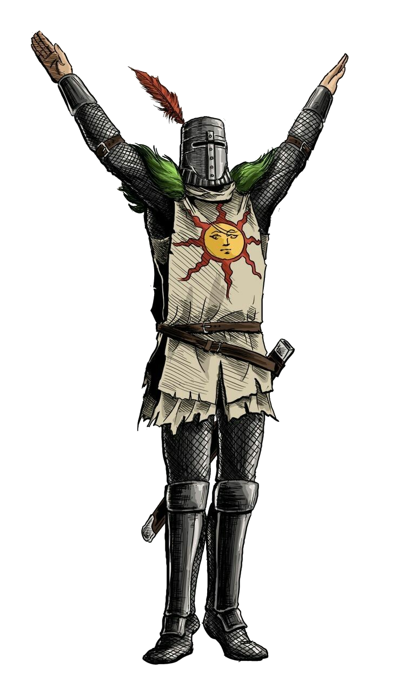

# Mekla: Elden Ring Companion

Mekla is a modern web application built with Next.js, designed to help Elden Ring players explore bosses, weapons, and items with ease. Featuring a beautiful UI, responsive design, and interactive components, Mekla is your go-to resource for discovering everything the Lands Between has to offer.



## 🚀 Live Demo

[Visit the deployed site](https://your-deployed-site-url.com)

---

## 📦 Available Scripts

In the project directory, you can run:

- `npm run dev` — **Start the development server** at [http://localhost:3000](http://localhost:3000)
- `npm run build` — **Build the app** for production
- `npm run start` — **Start the production server**
- `npm run lint` — **Run ESLint** to check for code issues
- `npm run test` — **Run tests** with Vitest
- `npm run format:check` — **Check code formatting** with Prettier
- `npm run storybook` — **Start Storybook** for UI component development ([http://localhost:6006](http://localhost:6006))
- `npm run build-storybook` — **Build Storybook** for static deployment

---

## 🛠️ Usage

1. **Install dependencies:**
   ```bash
   npm install
   ```
2. **Start the development server:**
   ```bash
   npm run dev
   ```
3. **Open your browser:**
   Go to [http://localhost:3000](http://localhost:3000)

---

## 🖼️ Screenshots

You can find images and assets in the `public/` folder, such as `bosses.jpg`, `weapons.jpg`, and `items.jpg`.

---

## 🤝 Contributing

Pull requests are welcome! For major changes, please open an issue first to discuss what you would like to change.

---

## 📄 License

This project is licensed under the MIT License.

---

> Built with ❤️ using Next.js, React, and Tailwind CSS.
